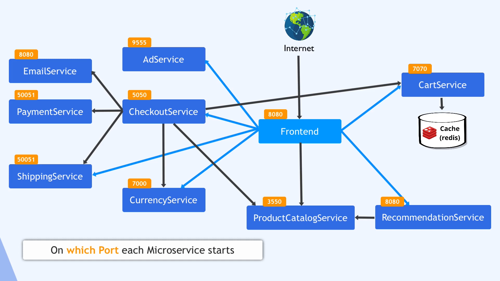

to deploy microservices using config files:
```
kubectl apply -f .\microservices\ --recursive
```
to deploy a single microservice using helm:
```
helm install -f values/email-service-values.yaml emailservice charts/microservice
```
to deploy microservices using helmfile:
```
helmfile sync
```

to destroy microservices using helmfile:
```
helfile destroy
```

